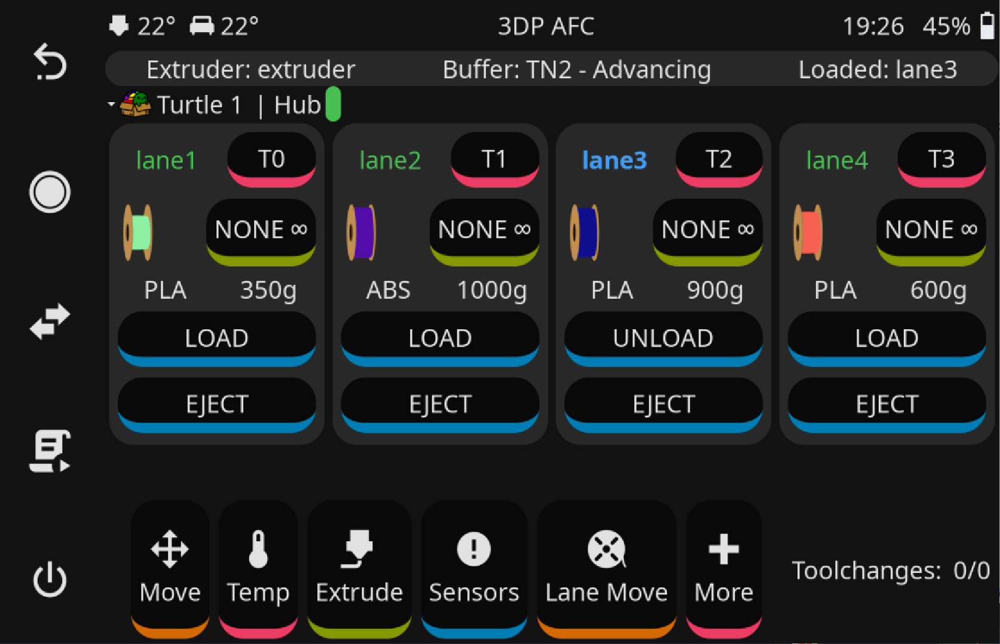
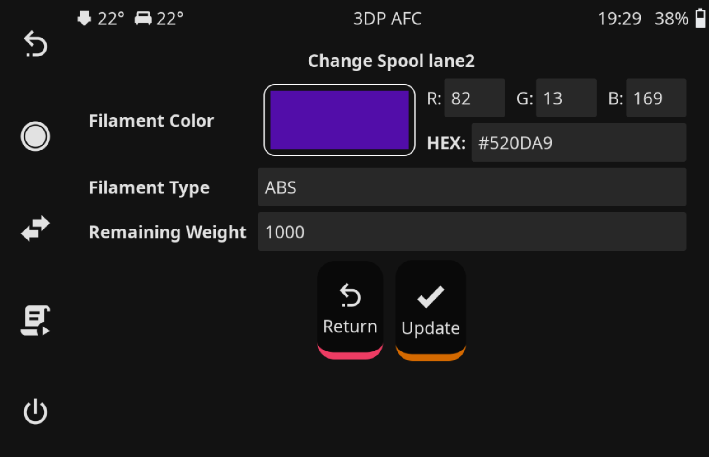
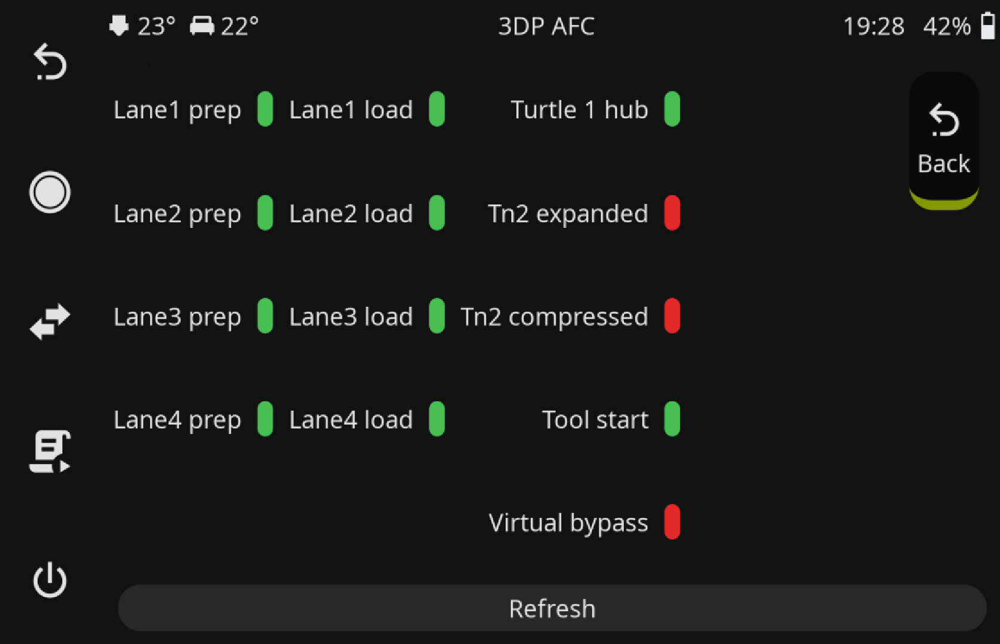

# AFC-Klipper-Screen-Add-On
This repository contains a KlipperScreen add-on for the AFC (Automatic Filament Change) feature. It provides a 
user-friendly interface to manage filament changes directly from KlipperScreen.

It does **NOT** require any changes to your current KlipperScreen configuration and simply adds onto your existing 
installation.

**Note:** This is not tested with the Happy-Hare variant of KlipperScreen and is designed to work with the 
release version of KlipperScreen available [here](https://klipperscreen.readthedocs.io/en/latest/).

## Prerequisites

- KlipperScreen installed and running. Please visit [KlipperScreen](https://klipperscreen.readthedocs.io/en/latest/) 
  for installation instructions.

## Usage

```bash
Usage: ./install.sh [-p <printer_config>] [-k <klipperscreen_dir>] [-h]
Options:
  -p <printer_config>    Path to the printer configuration directory (default: $HOME/printer_data/config)
  -k <klipperscreen_dir> Path to the KlipperScreen directory (default: $HOME/KlipperScreen)
  -h                     Show this help message
```

<a name="installation"></a>
## Installation

### Automatic install

This method is the recommended way to install the AFC-Klipper-Screen-Add-On. It will automatically download
and install the necessary files to your KlipperScreen installation.

To install this plugin, you can use the following commands from a terminal session:

```bash
cd ~
git clone https://github.com/ArmoredTurtle/AFC-Klipper-Screen-Add-On.git
cd AFC-Klipper-Screen-Add-On
./install.sh
```

### Manual install

If you have a custom installation of KlipperScreen or prefer to install the add-on manually, you can do so by following:
1. Download the necessary files from this repository.

- `AFC.py`: This is the main panel file for the AFC feature. This should be placed in the KlipperScreen `panels` folder.
- `afc_icons`: This folder contains the icons used in the AFC panel. This directory should be placed in the base 
  KlipperScreen folder.
- `AFC_menu.conf`: This is the configuration file for the AFC menu. This should be placed in the `~/printer_data/config` 
  directory.
- The following data should be added to your `KlipperScreen.conf` file:
```ini
[include AFC_menu.conf]
```

### Moonraker Update Manager

If you are using the Moonraker Update Manager, you can add the following to your `moonraker.conf` file:

```ini
[update_manager afc-klipperscreen-add-on]
type: git_repo
path: ~/AFC-Klipper-Screen-Add-On
origin: https://github.com/ArmoredTurtle/AFC-Klipper-Screen-Add-On.git
managed_services: KlipperScreen
primary_branch: main
is_system_service: False
info_tags:
    desc=AFC KlipperScreen Add On
```

# Example Images
## Main Panel



## Filament Configuration 


## AFC Sensor Configuration


## AFC Lane Movement


# Support

[](https://discord.gg/eT8zc3bvPR)

Armored Turtle Configuration / Build Manuals [here](https://armoredturtle.xyz/)
